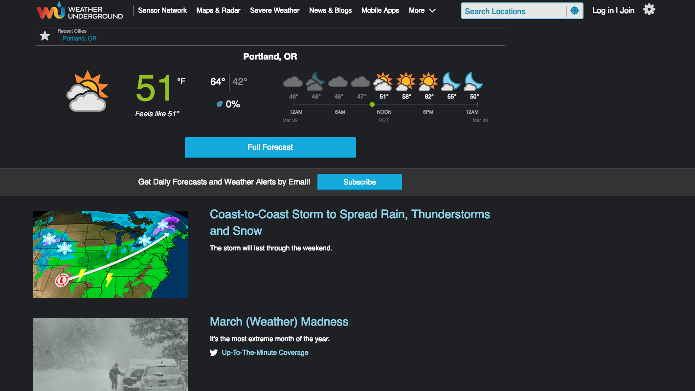

# Weather Underground Angular Clone

This project was generated with [Angular CLI](https://github.com/angular/angular-cli) version 7.3.6.

## Description

Weather Underground clone created with Angular. Primary goal is to create landing page and link with Dark Sky API.

Weather Underground Landing Page

## Installation

`Git clone https://github.com/dinowins/angular-clone`

`Npm install` to install dependencies

## Specs
Specification | Input | Output
------------- | ----- | ------
Landing page should look the same as Weather Underground landing page | |
Should click on a link and see the corresponding link | |

## Completed Features

## RoadMap

Features wishlist:

- Login page

- Signup page

- Use weather API to pull data

- Individualized city weather page

## Component Tree

root --> homepage | header | footer | login | signup
homepage --> homepage-mast | region-caster | signup-hero

## Development server

Run `ng serve` for a dev server. Navigate to `http://localhost:4200/`. The app will automatically reload if you change any of the source files.

## Code scaffolding

Run `ng generate component component-name` to generate a new component. You can also use `ng generate directive|pipe|service|class|guard|interface|enum|module`.

## Build

Run `ng build` to build the project. The build artifacts will be stored in the `dist/` directory. Use the `--prod` flag for a production build.

## Further help

To get more help on the Angular CLI use `ng help` or go check out the [Angular CLI README](https://github.com/angular/angular-cli/blob/master/README.md).

##Technologies
JavaScript, Angular, DarkSky API

## Contributing
Pull requests are welcome. For major changes, please open an issue first to discuss what you would like to change.

Please make sure to update tests as appropriate.

## License
([MIT](https://choosealicense.com/licenses/mit/)) The Weather Underground Angular Clone is licensed under the terms of the MIT license and is available for free
